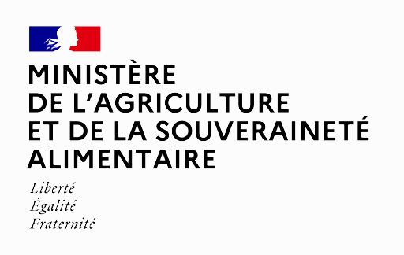

pyCross, introduction
*********************

**pyCross** est un logiciel interfacé de visualisation, d'édition, de mise en page, d'analyse et de traitement de profils en travers, dédié à l'hydraulique torrentielle et aux chutes de blocs en montagne.

**pyCross** a été développé par les Services de Restauration de Terrains en Montagne de  `l'Office National des Forêts <https://www.onf.fr>`_ et financé par `le Ministère de l'Agriculture et de la Souveraineté Alimentaire <https://agriculture.gouv.fr>`_.
   

Afin de contribuer à sa diffusion, nous vous invitons à citer **pyCross** dans vos productions en utilisant la référence suivante:

- ONF-RTM. pyCross [Logiciel interfacé et librairie Python de visualisation, d'édition, de mise en page, d’analyse et de traitement de profils en travers]. https://pycross.readthedocs.io/fr/latest/
